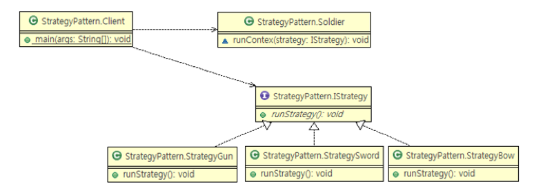

package > ex1  
https://western-sky.tistory.com/m/41

package > ex2  
https://java-design-patterns.com/patterns/callback/

package > ex3 : strategy pattern / template callback pattern  
https://imbf.github.io/spring/2020/03/18/Spring-Design-Pattern(3).html

package > ex4 : asynchronous and synchronous callback in java  
https://www.geeksforgeeks.org/asynchronous-synchronous-callbacks-java/  
used in observer design pattern 